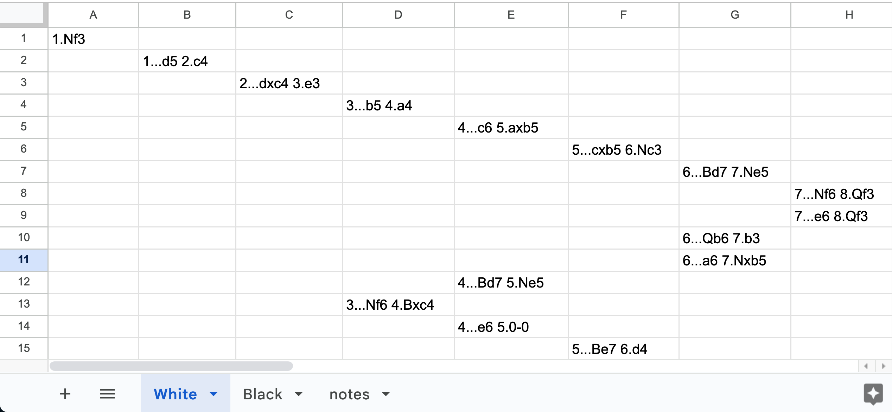
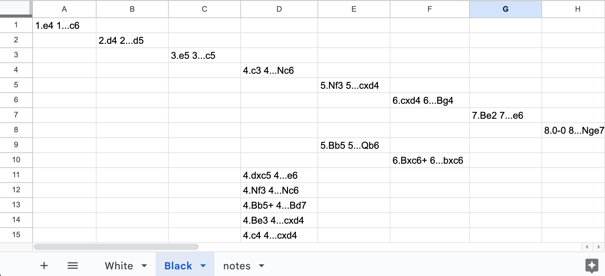

# chess-opening-study
Installation:
* Clone the Repository
* Create a Conda environment using `environment.yml`

Setup:
* Create a Google Sheet with 'White' and 'Black' tabs, each with opening moves enumerated
    * see examples below
    * Use indentation for deeper moves as shown. Must use official [Chess Algebraic Notation](https://en.wikipedia.org/wiki/Algebraic_notation_(chess)).
    * Each box should have two moves separated by a space (with the exception of the very first move), with the opponent's move first and the move to learn second.
    * Note: substitute the '#' character for any move to learn in the Google Sheet (e.g. '2...d5 3.#'), and the trainer will ignore that opening move. This can be useful when dealing with chess boards reached by multiple paths.
* Create a Google Workspace project with access to Google Sheets
    * see https://console.cloud.google.com/
    * create an OAuth client id for the project and download the client id and secret into a file 'credentials.json'
* In the root directory, create sheet_id.txt (a single-line text file with the Google Sheet id)
* Move credentials.json (from the Google Workspace step) to root directory

Usage:
* Once in the new Conda environment, run `jupyter notebook`
* Run the chunks in Train.ipynb

